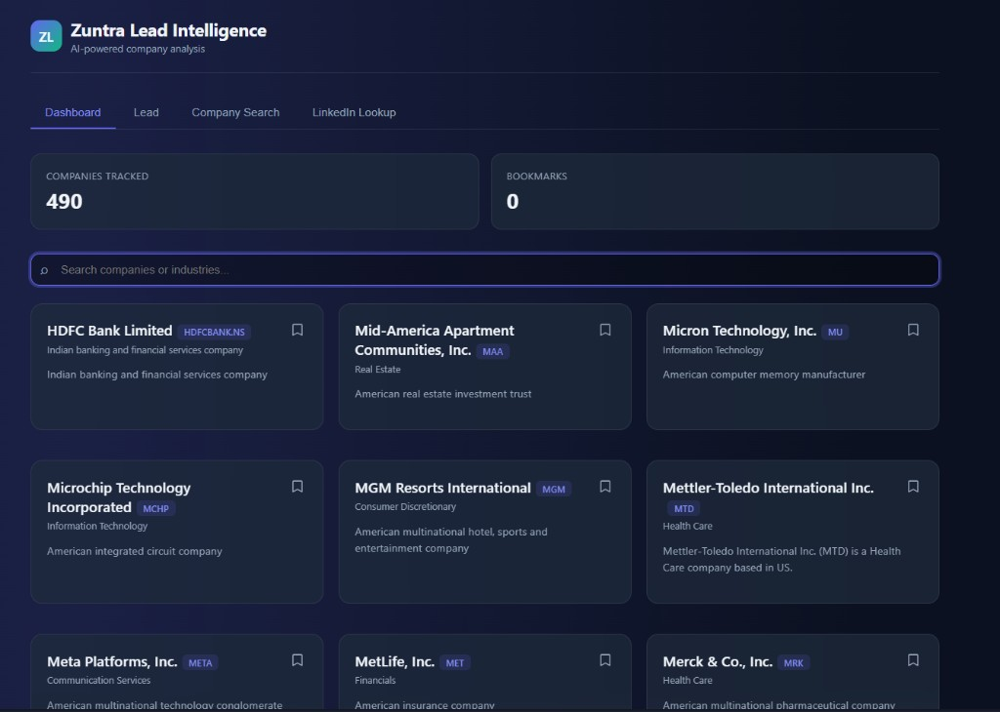
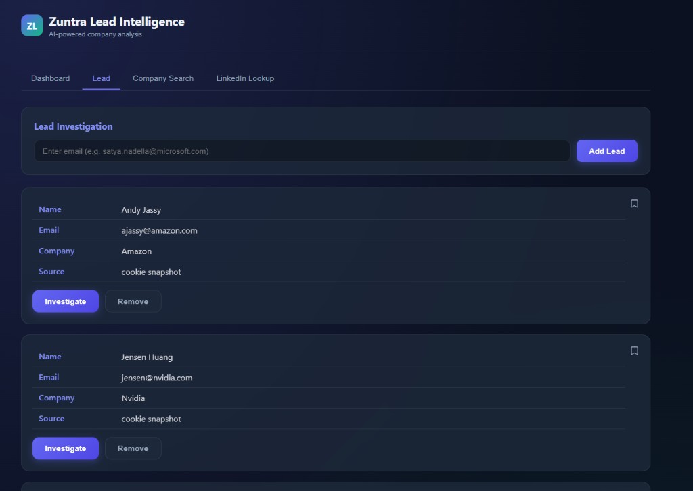
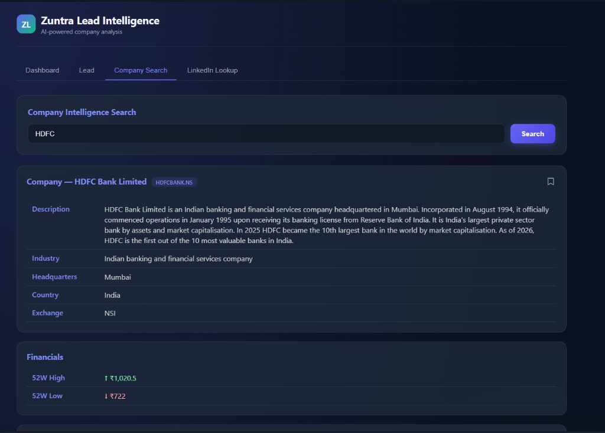
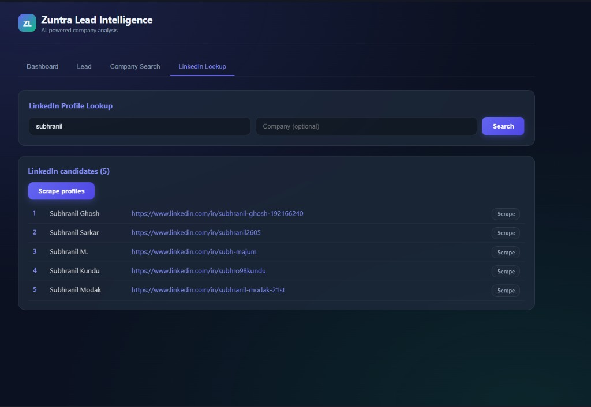

# Zuntra Lead Intelligence

**AI-powered company analysis for lead investigation, market dossiers, and LinkedIn lookup.**

A dark-mode web app that turns an email, company name, or LinkedIn search into a structured intelligence dossier — identity, financials, filings, news, and profiles — then stores it in Supabase so the dashboard stays in sync.


---

## Screenshots

### Dashboard — tracked companies, bookmarks, and industry search



### Lead — add an email, investigate, stop a run, and bookmark the company



### Company Search — full dossier with description, exchange, and 52-week range



### LinkedIn Lookup — people search, candidate list, scrape one or all, stop mid-run



---

## Features

| Capability | Detail |
|---|---|
| Dashboard | Companies tracked, bookmarks, search by name or industry |
| Lead investigation | Email → company dossier + LinkedIn action; news on demand |
| Company Search | Identity, financials, filings, and news in one pipeline |
| LinkedIn Lookup | Name/company search, candidate table, scrape profiles |
| Progress + stop | Live progress bars; stop investigation or scrape without losing what already landed |
| Bookmarks | Pin companies; bookmarked cards surface first on the dashboard |
| Persistence | Dossiers, cache, news, workspace, and bookmarks in Supabase |

---

## Architecture

```text
Browser (front/)
        │
        ▼
Flask UI API (ui/app.py :5000)
        │
        ├── Company pipeline  → Yahoo · Finnhub · Wikipedia · SEC / NSE · news
        ├── Lead finder       → email parse → company (no news until Look up news)
        ├── LinkedIn scrape   → Playwright session
        └── Groq (optional)   → relevance + arranged overview text
                │
                ▼
        Supabase (companies · source_cache · news_days · workspace · bookmarks)
```

The SPA talks only to Flask. Flask is the only client of Supabase.

---

## Project structure

```text
.
├── assets/                 # README screenshots
├── front/                  # Dark-mode SPA (HTML / CSS / JS)
├── ui/                     # Flask app and API
├── web scraper/            # Company intelligence pipeline
├── lead finder/            # Email → company orchestration
├── linkedin scrape/        # Playwright profile extraction
├── supabase/schema.sql     # Tables + RLS policies
├── requirements.txt
└── not to share/           # gitignored: .env, venv, cookies, LinkedIn session
```

---

## Requirements

- Python 3.11+
- Internet access for market, news, and LinkedIn requests
- A [Supabase](https://supabase.com) project (run `supabase/schema.sql` once)
- Playwright Chromium for LinkedIn and article body fetch

---

## Setup

```powershell
git clone <this-repo>
cd "ALL Knowing"

python -m venv "not to share\.venv"
.\not to share\.venv\Scripts\Activate.ps1
pip install -r requirements.txt
python -m playwright install chromium
```

Create `not to share\.env` (never commit it). Names only:

```env
FINNHUB_API_KEY=
ALPHA_VANTAGE_API_KEY=
SEC_USER_AGENT=
NEWSAPI_API_KEY=
GNEWS_API_KEY=
GROQ_API_KEY=
GROQ_MODEL=
NEWS_GROQ_MODEL=
GITHUB_TOKEN=
LINKEDIN_EMAIL=
LINKEDIN_PASSWORD=
SUPABASE_URL=
SUPABASE_SERVICE_ROLE_KEY=
```

| Variable | Used for |
|---|---|
| `FINNHUB_API_KEY` | Ticker resolve and profile |
| `ALPHA_VANTAGE_API_KEY` | Overview / financials |
| `SEC_USER_AGENT` | SEC EDGAR (`AppName you@email.com`) |
| `NEWSAPI_API_KEY` / `GNEWS_API_KEY` | News discovery |
| `GROQ_API_KEY` | News relevance and overview text |
| `LINKEDIN_EMAIL` / `LINKEDIN_PASSWORD` | Profile scrape session |
| `SUPABASE_URL` / `SUPABASE_SERVICE_ROLE_KEY` | Dossiers, cache, workspace, bookmarks |

Apply [`supabase/schema.sql`](supabase/schema.sql) in the Supabase SQL editor so `companies`, `source_cache`, `news_days`, `workspace`, and `bookmarks` exist.

---

## Usage

```powershell
.\not to share\.venv\Scripts\Activate.ps1
python ui\app.py
```

Open [http://127.0.0.1:5000](http://127.0.0.1:5000)

| Tab | What you do |
|---|---|
| Dashboard | Browse tracked companies, search, open a card, bookmark |
| Lead | Add an email → **Investigate** → **View** → **Look up news** if you want articles |
| Company Search | Name or ticker → full dossier including news |
| LinkedIn Lookup | Name + optional company → **Scrape profiles** or scrape one row; **Stop** cancels |

Ctrl+C in the terminal stops the server.

---

## Tech stack

| Layer | Tools |
|---|---|
| Language | Python 3.11+ |
| UI | Flask + vanilla JS SPA |
| Company data | Yahoo · Finnhub · Alpha Vantage · Wikipedia · SEC EDGAR · NSE |
| News | NewsAPI · GNews · Playwright article open |
| LLM | Groq |
| LinkedIn | Playwright |
| Store | Supabase (Postgres + JSONB) |

---

## Notes

- Do not commit `not to share/`, `.env`, or API keys
- Company Search includes news; Lead investigation does not until **Look up news**
- LinkedIn automation can break when the site changes, and accounts can be restricted — keep volume low
- Without Playwright Chromium, company search still runs; article bodies stay thin
- Alpha Vantage has a daily soft cap (`av_day.json` under the private cache)

---

## Author

**Subhranil Ghosh** ([@w0lf-s](https://github.com/w0lf-s)) — Software Engineer focused on AI, backend systems, and scalable intelligent applications.

---

## License

MIT
